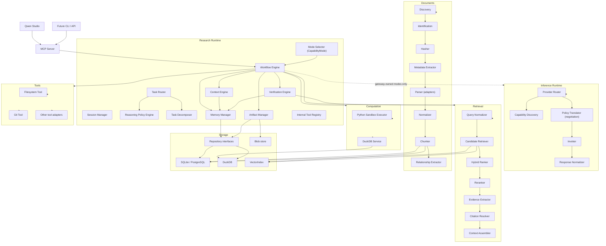

# Component Dependencies

**Rules encoded here**

- The **Research Runtime** orchestrates; subsystems are leaves with respect to
  orchestration. The **MCP Server** is an adapter above it; the **Inference
  Runtime** is a leaf below it.
- `WE` (Workflow Engine) is the hub inside the Research Runtime — it fans out
  to context, memory, verification, artifacts, retrieval, computation, and
  tools.
- The `WE → Inference Runtime` edge is **dashed**: exercised only in
  `GATEWAY_INFERENCE`/`HYBRID` modes (enforced by the Mode Selector).
- The Inference Runtime never points back up into the Research Runtime.
- Subsystems never point back at the Research Runtime or at each other.
- Storage is reached only through repository interfaces (`REPO`).
