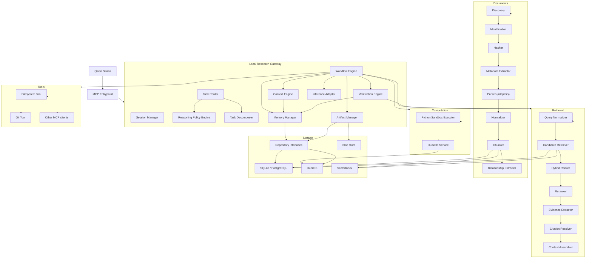

# Component Dependencies

**Rules encoded here**

- The gateway orchestrates; subsystems are leaves with respect to orchestration.
- `WE` (Workflow Engine) is the hub inside the gateway — it fans out to context,
  memory, verification, artifacts, inference, retrieval, computation, and tools.
- Subsystems never point back at the gateway or at each other.
- Storage is reached only through repository interfaces (`REPO`).
