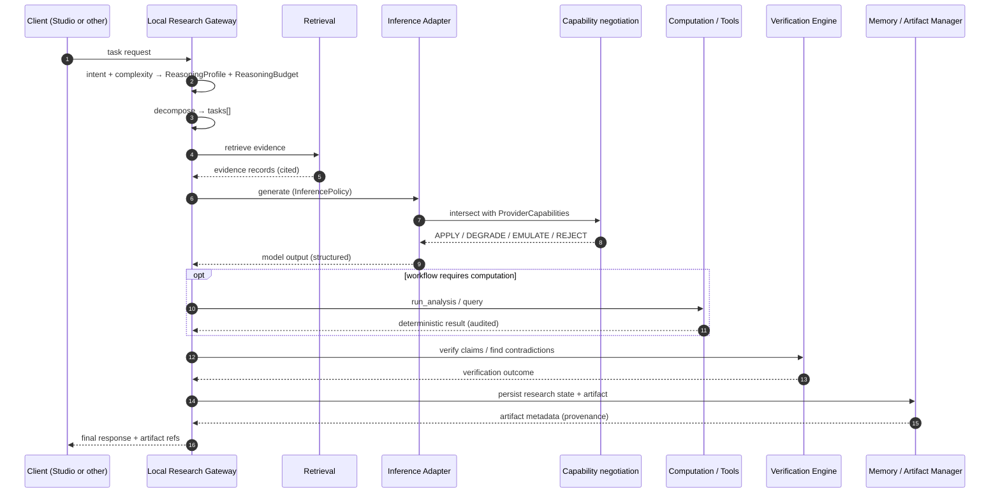
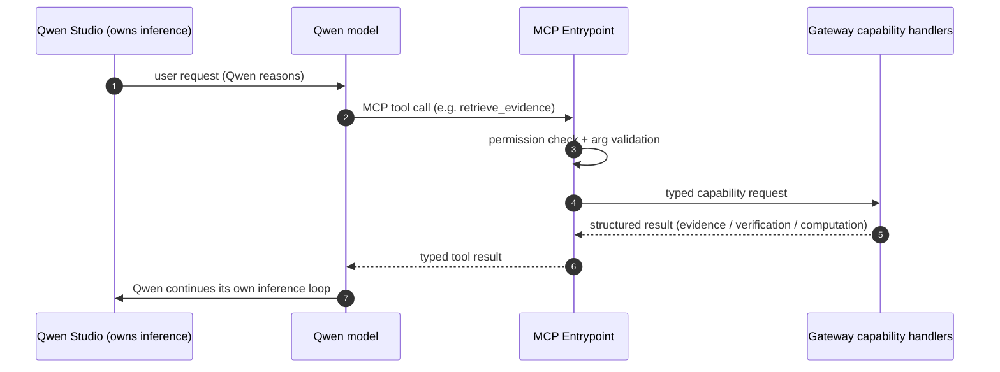
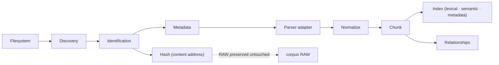

# Data Flow

The request path is **mode-dependent**. The first sequence below is the
`GATEWAY_INFERENCE` path (the only path that exercises the Inference Adapter);
the second is `STUDIO_NATIVE`.

## GATEWAY_INFERENCE

## STUDIO_NATIVE

**Persistence side-channel (not shown for clarity)**

- After each stage, the Workflow Engine writes a **stage checkpoint** to the
  Memory Manager, enabling resume from the last completed stage.
- Hidden chain-of-thought never appears in any message above; only structured
  outputs cross these arrows.

**Ingest flow (separate, one-way)**

