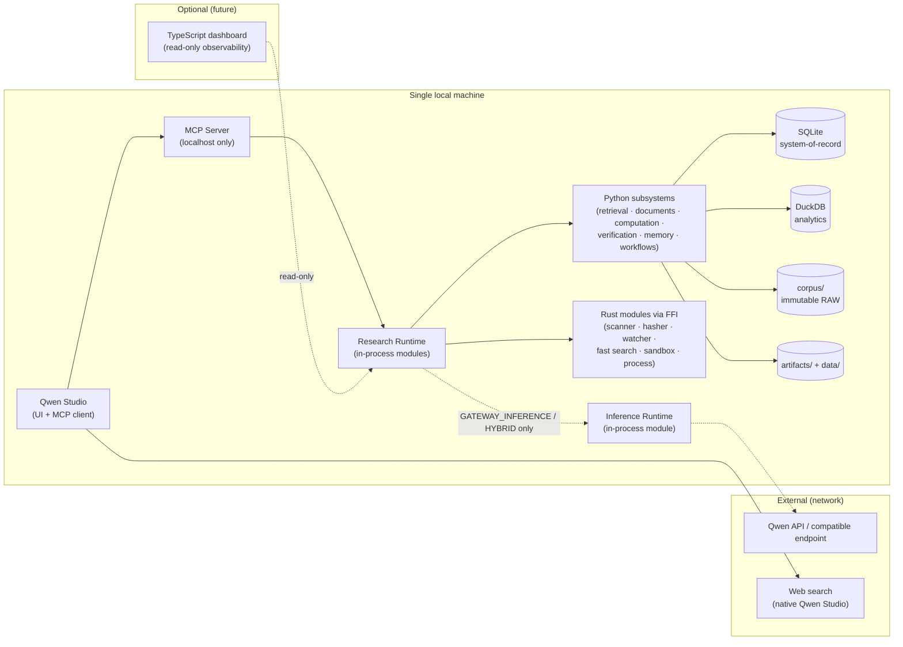

# Deployment Topology

**Binding rules shown here**

- `QS → MCP → RR` run on `127.0.0.1` / Unix sockets (local-only by default).
- `RR ↔ RUST` is **FFI (PyO3)**, not a network call.
- `RR ↔ PY` and `RR → IR` are **in-process** (no serialization boundary).
- The `IR → API` edge (model backend) is **conditional on mode**; it exists
  only in `GATEWAY_INFERENCE`/`HYBRID`. In `STUDIO_NATIVE` the Inference
  Runtime is not on the request path — Qwen Studio's own model/search
  connection is the only model-plane network.
- The dashboard is optional and read-only; the core runs without it.

**Deployment vs logical boundaries**

`apps/mcp-server`, `apps/research-runtime`, `apps/inference-runtime` are
**logical runtimes**, not three mandatory network daemons. In v1 they are one
core process (one executable / one Python package / one Rust library), with
optional ephemeral sandbox subprocesses for computation. A runtime is promoted
to a separate process only if isolation requires it (ADR 0021).
