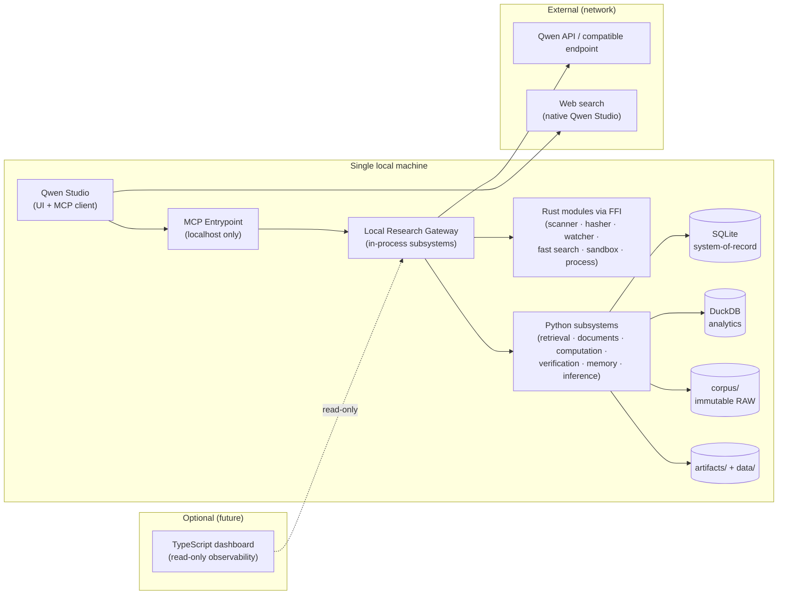

# Deployment Topology

**Binding rules shown here**

- `QS → MCP → GW` run on `127.0.0.1` / Unix sockets (local-only by default).
- `GW ↔ RUST` is **FFI (PyO3)**, not a network call.
- `GW ↔ PY` is in-process (no serialization boundary).
- The only outbound network is the model API (through the Inference Adapter)
  and Qwen Studio's own native web search.
- The dashboard is optional and read-only; the core runs without it.

**Process count in v1**

Exactly one long-lived core process (gateway + entrypoint + subsystems), plus
Qwen Studio as the external client, and optional ephemeral sandbox subprocesses
for computation. No microservices.
