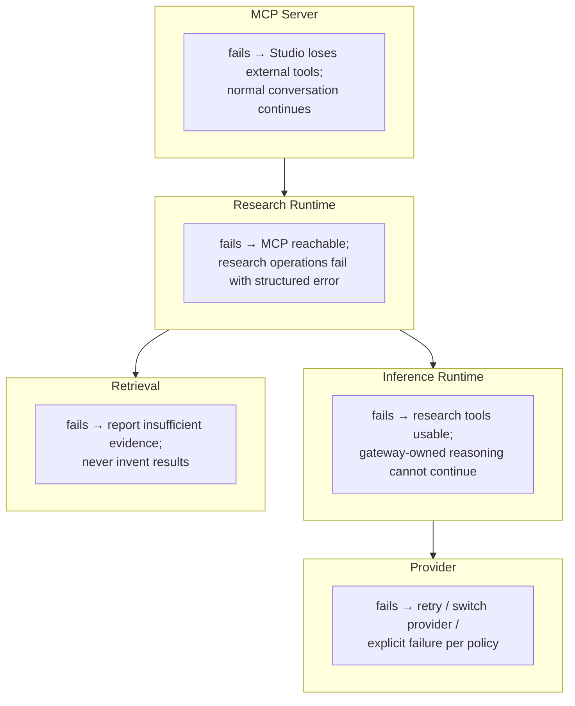

# Failure Isolation

Each runtime degrades a **bounded capability**, not the whole system (ADR 0022).

See [`runtime-boundaries.md`](../runtime-boundaries.md#10-failure-isolation) for
the full failure table.
