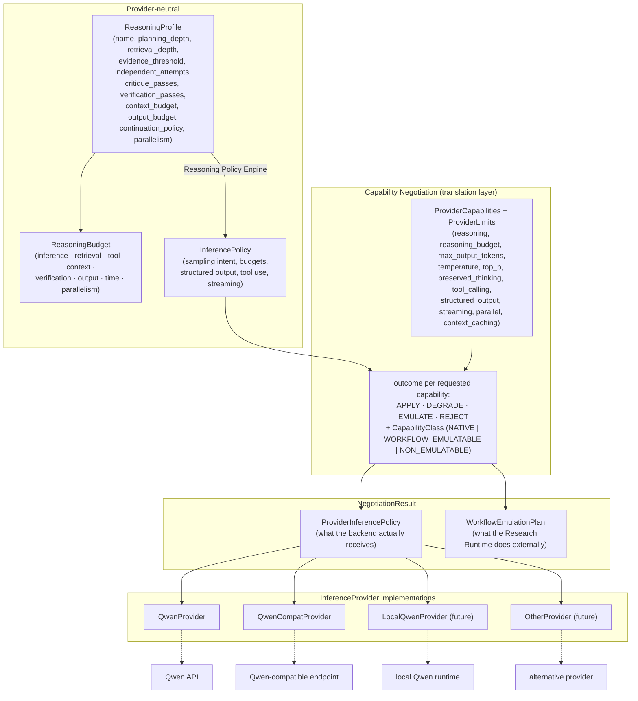
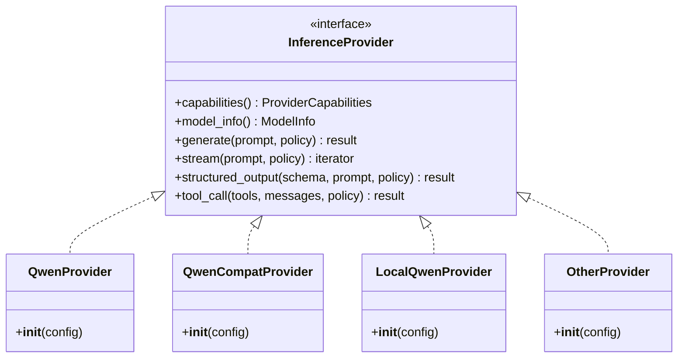

# Inference Abstraction

**Key property (Phase 1.2)**

`ReasoningProfile`/`ReasoningBudget` (behavior + resource allocation) and
`InferencePolicy` (how to call) are provider-neutral. Negotiation intersects
`InferencePolicy` with `ProviderCapabilities` (+ `ProviderLimits`) and produces
a `NegotiationResult` that **separates**:

- `ProviderInferencePolicy` — only what the backend will actually receive
  (native + degraded values). Emulated capabilities are **absent**.
- `WorkflowEmulationPlan` — the external workflow approximations for emulated
  capabilities (`EMULATE` ≠ pretending the provider supports a parameter).

This whole pipeline is exercised **only in `GATEWAY_INFERENCE`/`HYBRID` modes**;
in `STUDIO_NATIVE` it is not present in the execution path at all.

**Interface**

**Key property**

`ReasoningProfile`/`ReasoningBudget` (behavior + resource allocation) and
`InferencePolicy` (how to call) are provider-neutral. The capability
negotiation layer intersects `InferencePolicy` with `ProviderCapabilities` and
assigns each element an explicit `APPLY`/`DEGRADE`/`EMULATE`/`REJECT` outcome —
never assuming a parameter exists. This whole pipeline is exercised **only in
`GATEWAY_INFERENCE`/`HYBRID` modes**; in `STUDIO_NATIVE` it is not present in
the execution path at all.
