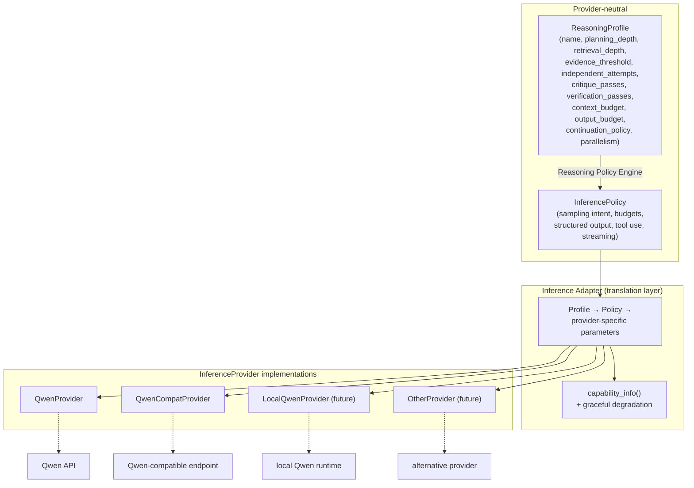
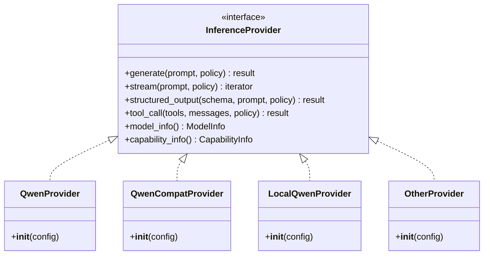

# Inference Abstraction

**Interface**

**Key property**

`ReasoningProfile` (behavior) and `InferencePolicy` (how to call) are
provider-neutral. Only the adapter knows provider-specific parameter names, and
only the adapter consults `capability_info()` to degrade gracefully when a
backend cannot honor part of a policy.
