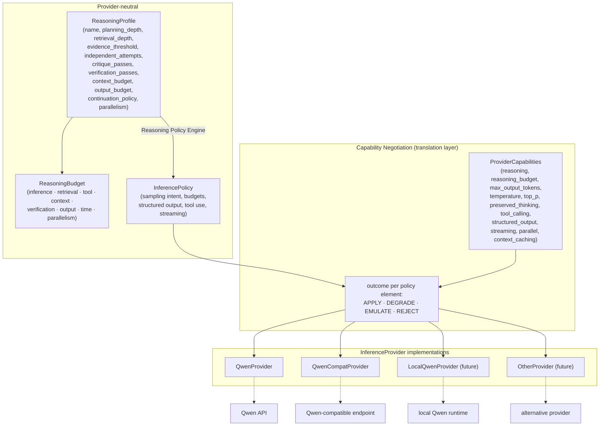
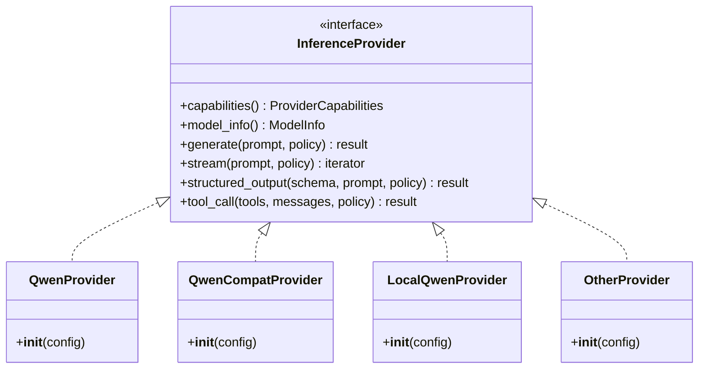

# Inference Abstraction

**Interface**

**Key property**

`ReasoningProfile`/`ReasoningBudget` (behavior + resource allocation) and
`InferencePolicy` (how to call) are provider-neutral. The capability
negotiation layer intersects `InferencePolicy` with `ProviderCapabilities` and
assigns each element an explicit `APPLY`/`DEGRADE`/`EMULATE`/`REJECT` outcome —
never assuming a parameter exists. This whole pipeline is exercised **only in
`GATEWAY_INFERENCE`/`HYBRID` modes**; in `STUDIO_NATIVE` it is not present in
the execution path at all.
