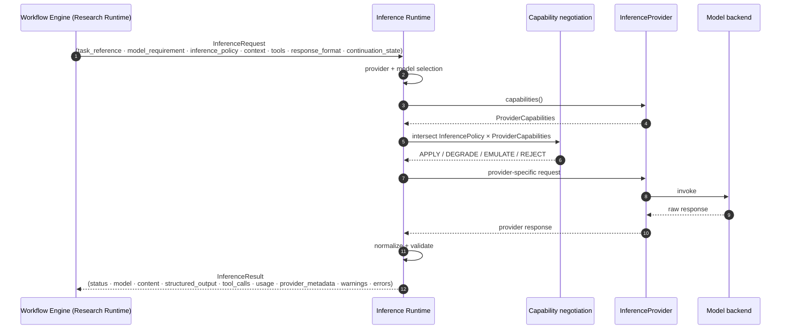

# Inference Request Path

**Rules**

- The Workflow Engine never constructs provider-specific requests; it only
  emits an `InferenceRequest`.
- The Inference Runtime never calls back into the Research Runtime.
- Hidden chain-of-thought never appears in `InferenceResult`.
- In `STUDIO_NATIVE` this path is not exercised at all.
