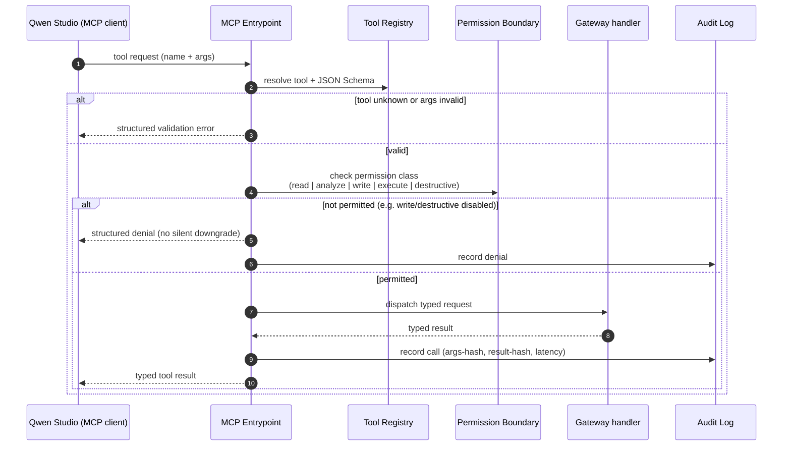
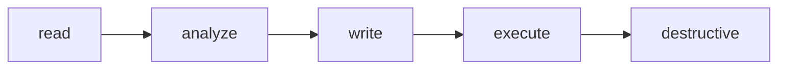
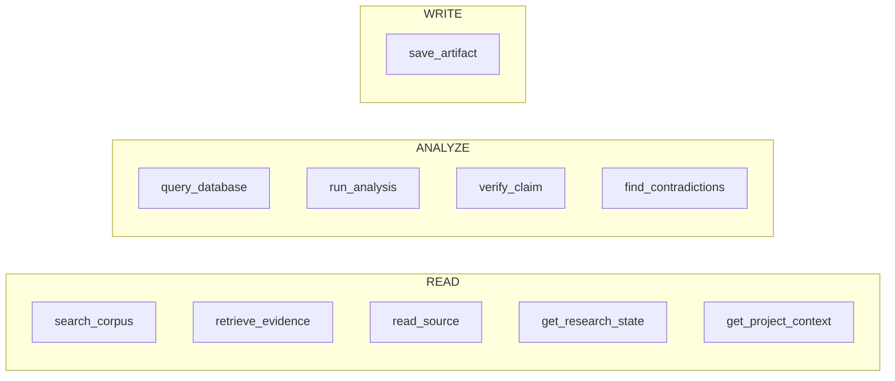

# MCP Interaction

**Permission escalation model**

Each arrow means "implies the previous capability but is controlled
independently." `write` and `destructive` are separately enabled and default
off; `destructive` additionally requires confirmation.

**Semantic tool surface (the only verbs exposed)**

