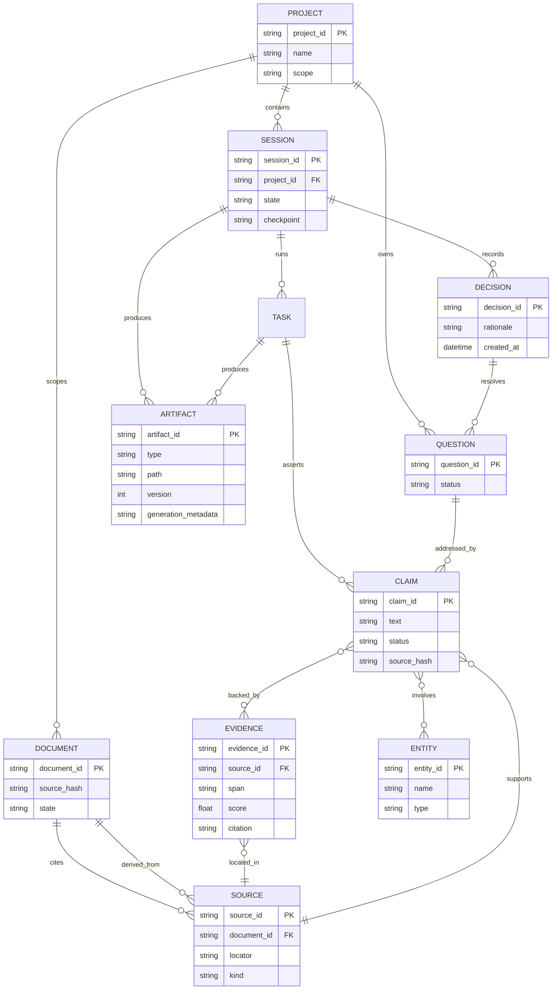

# Memory Model

**Notes**

- Six differentiated stores map onto these entities: Session Memory (session,
  task), Project Memory (project, document, source), Research Memory
  (cross-project claims/evidence), Knowledge Base (entity, relations),
  Unresolved Questions (question), Decision History (decision).
- `DECISION` is append-only.
- `DOCUMENT.state` enforces the RAW→INDEXED→STRUCTURED→DERIVED progression;
  RAW is never mutated.
- `CLAIM.source_hash` links claims to the immutable source version that
  supported them, enabling re-verification when a source changes.
