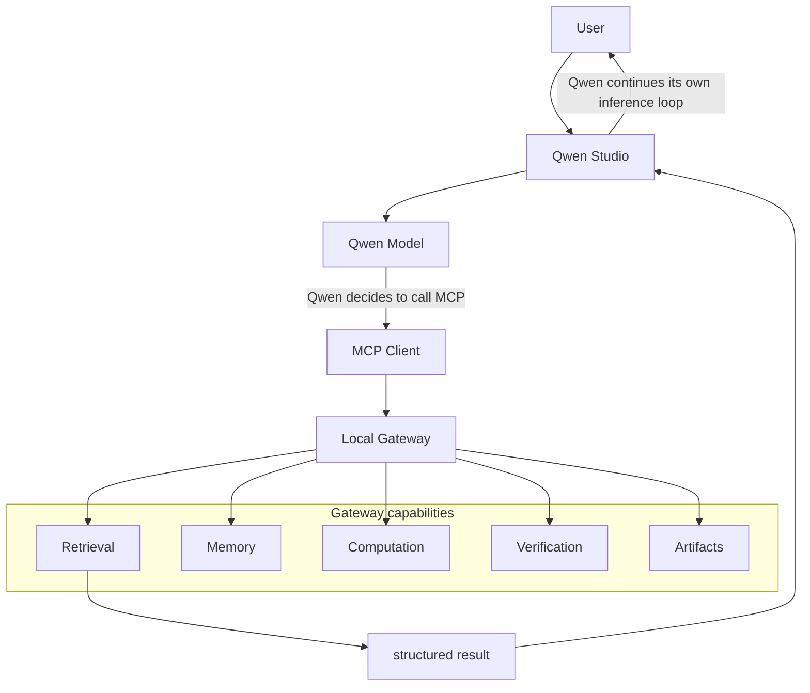
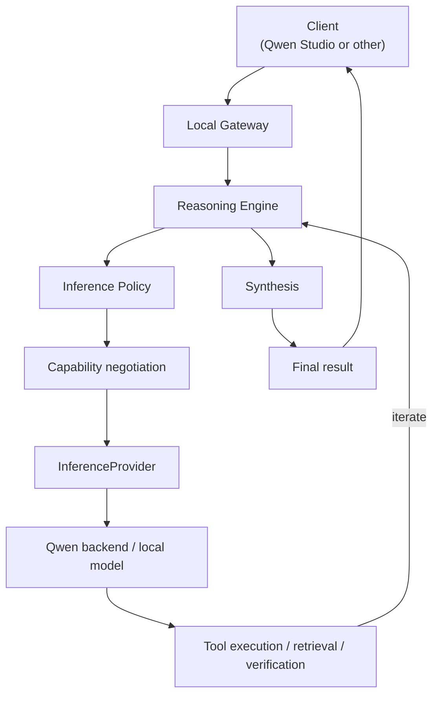
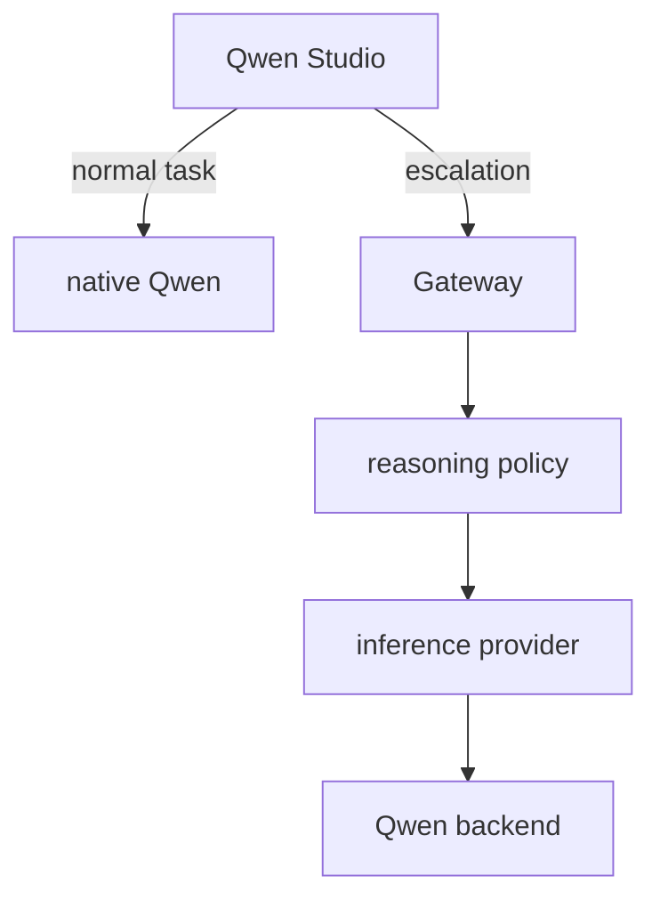
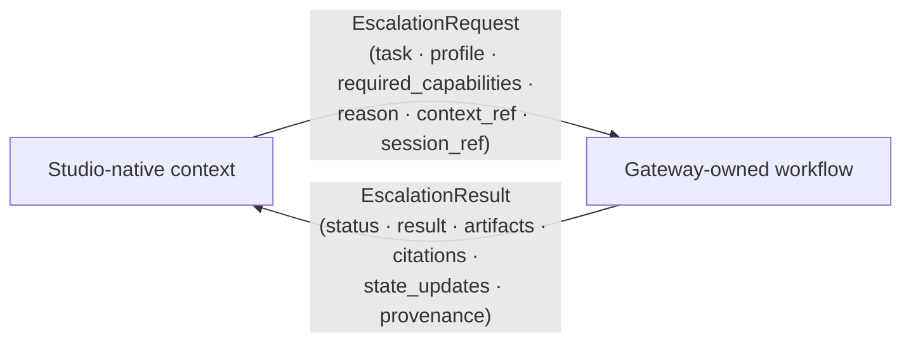
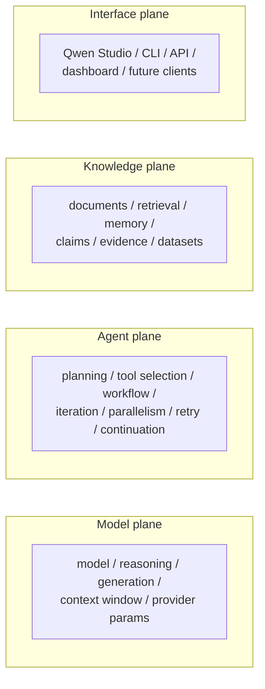

# Operating Modes

Three distinct execution paths. There is **no** universal
"Qwen Studio → gateway → inference" path.

## STUDIO_NATIVE (tool augmentation)

**Ownership:** Qwen Studio owns conversation, model selection, inference, and
reasoning. The gateway only provides capabilities.

## GATEWAY_INFERENCE (orchestration-owned)

**Ownership:** the gateway owns the workflow and explicitly invokes the
inference backend.

## HYBRID (escalation)

## Escalation boundary

## Four control planes

The gateway always operates the **agent** and **knowledge** planes; it operates
the **model** plane only in `GATEWAY_INFERENCE`/`HYBRID` modes; the **interface**
plane is the client, not owned by the gateway.
