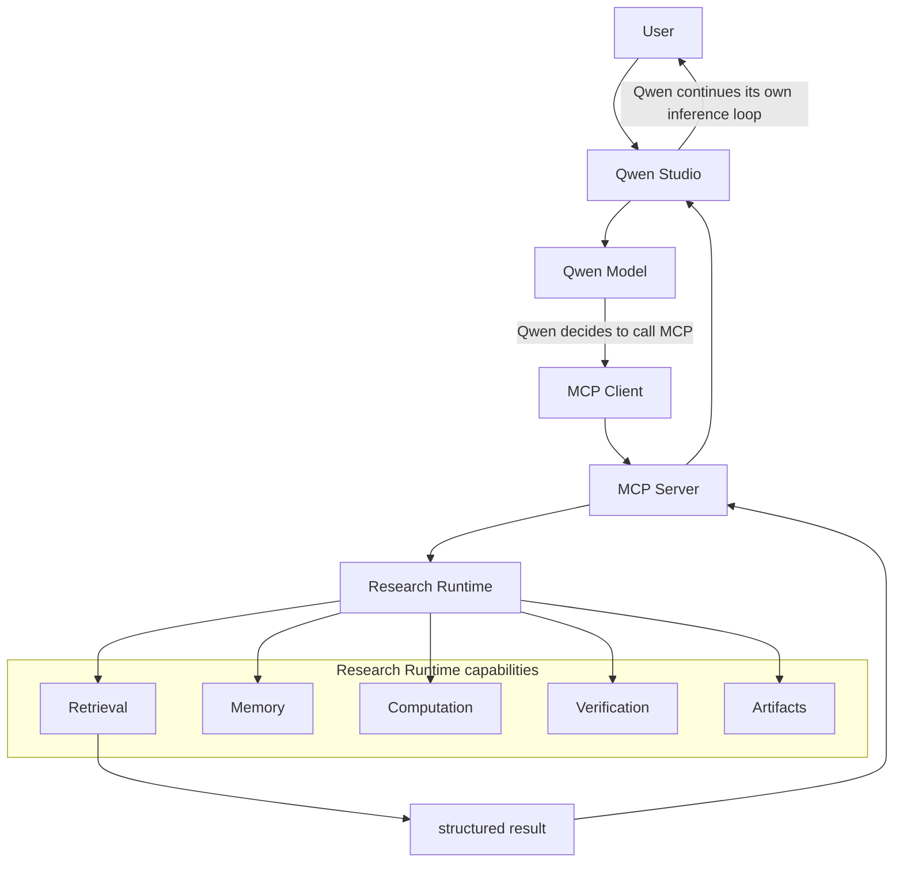
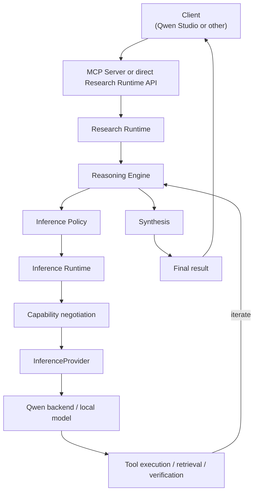
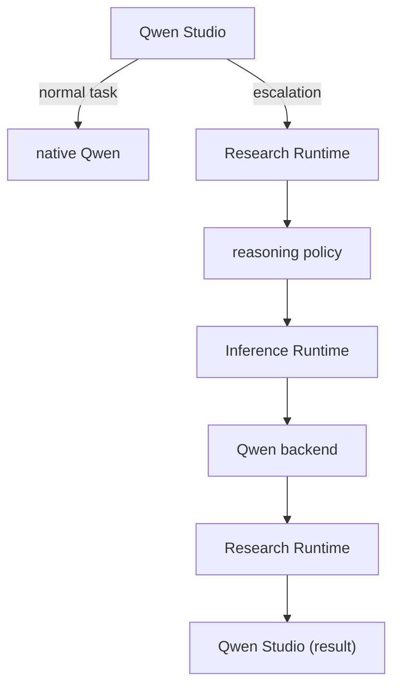
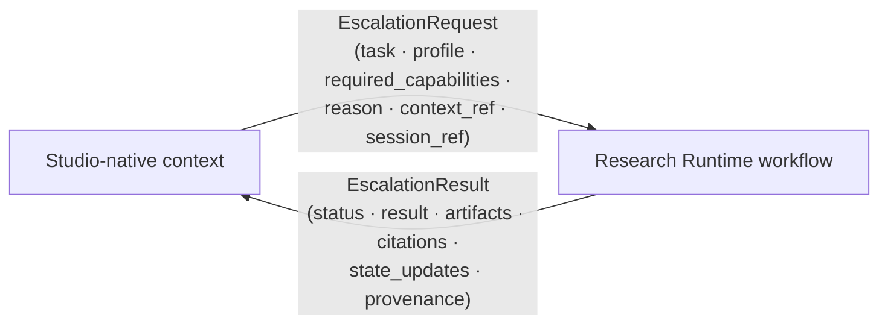
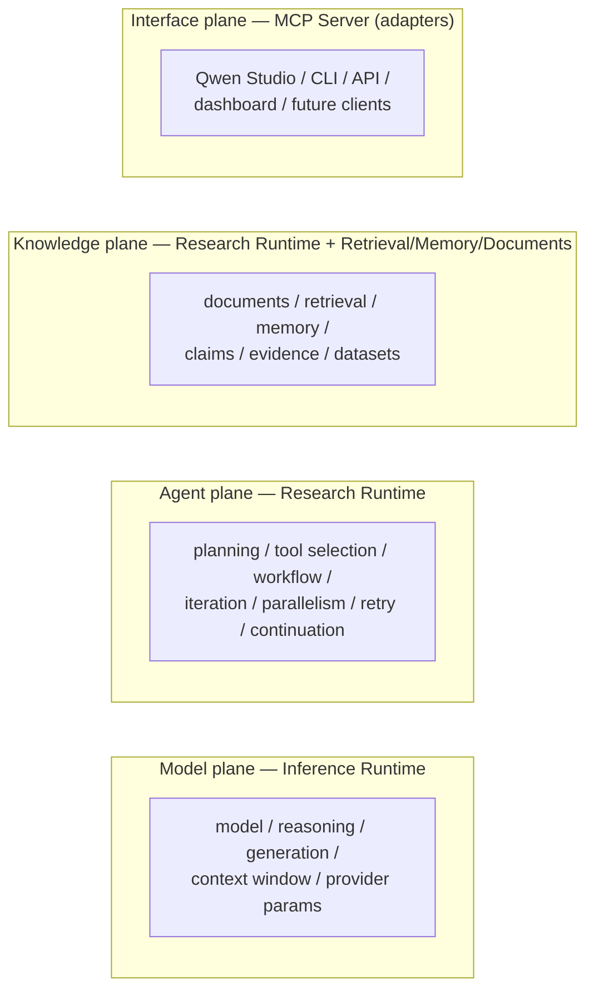

# Operating Modes

Three distinct execution paths. There is **no** universal
"Qwen Studio → gateway → inference" path, and Qwen Studio's model inference is
never routed through the MCP Server.

## STUDIO_NATIVE (tool augmentation)

**Ownership:** Qwen Studio owns conversation, model selection, inference, and
reasoning. The MCP Server + Research Runtime only provide capabilities; the
**Inference Runtime is not on the request path**.

## GATEWAY_INFERENCE (orchestration-owned)

**Ownership:** the Research Runtime owns the workflow; the Inference Runtime
owns each individual model invocation.

## HYBRID (escalation)

## Escalation boundary

## Four control planes → runtime ownership

The Research Runtime always operates the **agent** and (parts of the)
**knowledge** planes; the Inference Runtime operates the **model** plane only
in `GATEWAY_INFERENCE`/`HYBRID` modes; the **interface** plane is the client,
adapted by the MCP Server.
