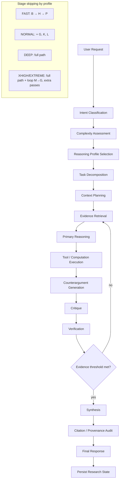

# Reasoning Workflow

**Notes**

- `M → G` is the verification-driven loop: unmet evidence threshold sends the
  workflow back to retrieval, then reasoning.
- `K → L` (critique → verification) may itself repeat up to
  `critique_passes`/`verification_passes` from the active profile.
- Every stage checkpoints, so a resumed session restarts after the last
  completed stage (see `data-flow.md`).
