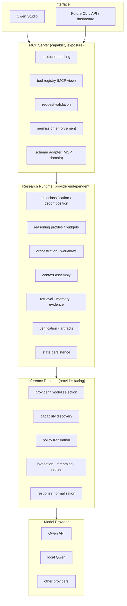
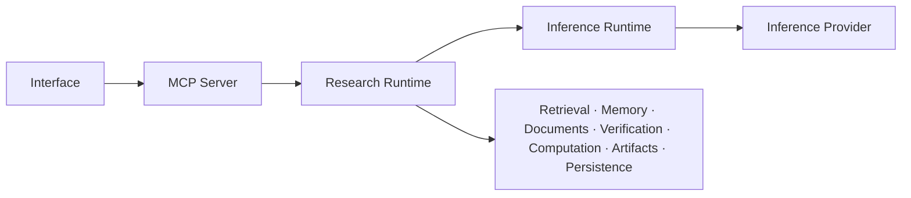
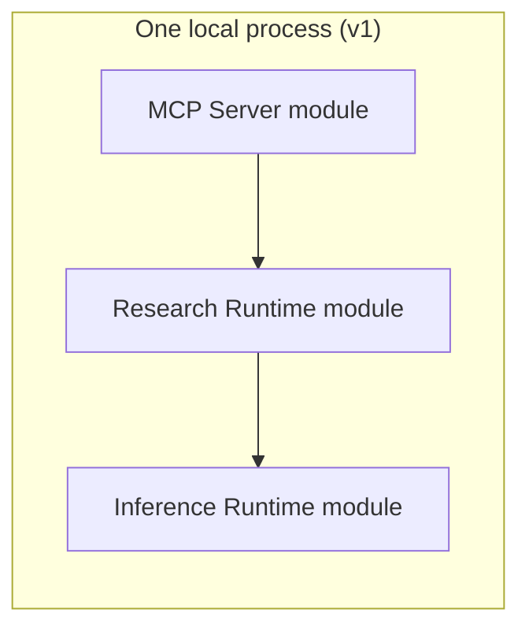

# Runtime Architecture

Three logically distinct runtimes replacing the monolithic "gateway".

## Dependency direction

- The Inference Runtime never calls upward into the Research Runtime.
- No circular dependencies.

## Logical vs deployed

`apps/mcp-server`, `apps/research-runtime`, `apps/inference-runtime` are
logical runtimes — not three mandatory network daemons (ADR 0021).
