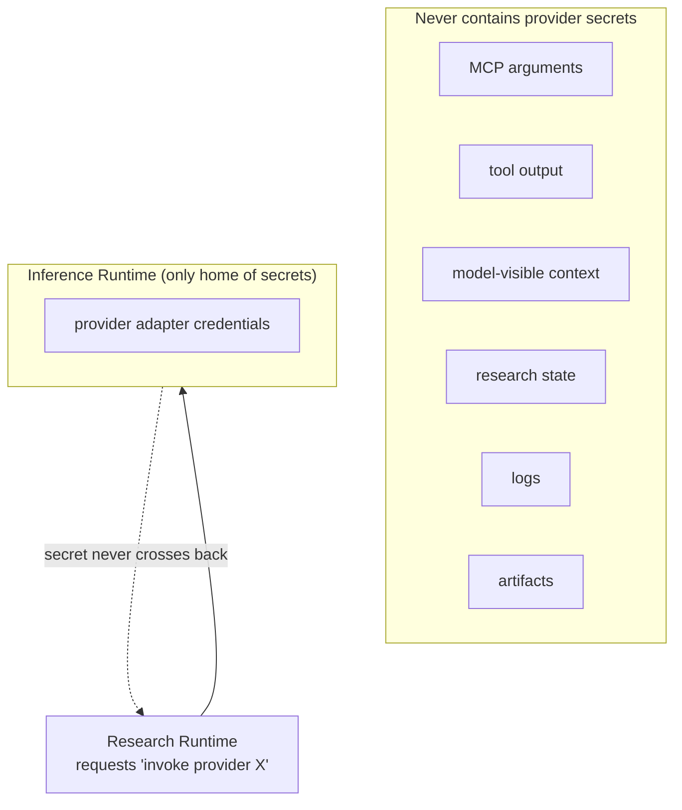

# Credential / Security Boundaries

## Permission domains (layered)

A client allowed `search_corpus` is **not** automatically allowed `run_python`,
`invoke_inference_backend`, `write_files`, or `delete_files`.

## Credential boundary

- Provider secrets belong **exclusively** to the Inference Runtime / provider
  adapter.
- The Research Runtime may request *"invoke provider X"* but does not receive
  or manage the raw API key.
- A tool must not automatically gain access to provider credentials.

See [`security.md`](../security.md#38-permission-domains-layered) and
[`security.md`](../security.md#39-credential-boundary).
