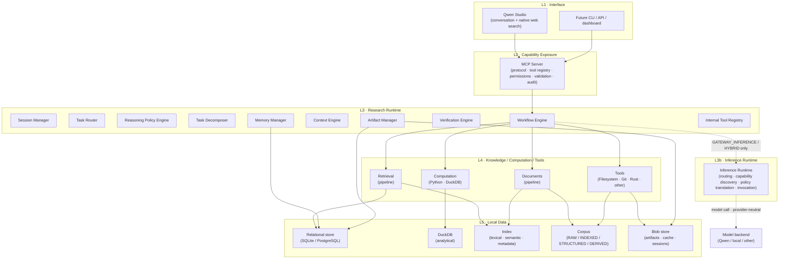

# System Architecture

**Notes**

- Dependencies point strictly downward (Interface → MCP Server → Research
  Runtime → Inference Runtime → Provider).
- This is the **capability topology**, not a universal execution path. The
  `Inference Runtime` and its edge to the model backend are **conditional on
  mode**: dormant in `STUDIO_NATIVE`, active in `GATEWAY_INFERENCE`/`HYBRID`.
  See [`operating-modes.md`](operating-modes.md) and
  [`runtime-boundaries.md`](../runtime-boundaries.md).
- The Inference Runtime is the *only* component that contacts a model backend,
  through the provider-neutral `InferenceProvider` interface.
- `QW` (model backend) is outside the system and swap-able. In `STUDIO_NATIVE`
  the model backend lives inside Qwen Studio — its inference is never routed
  through the MCP Server.
