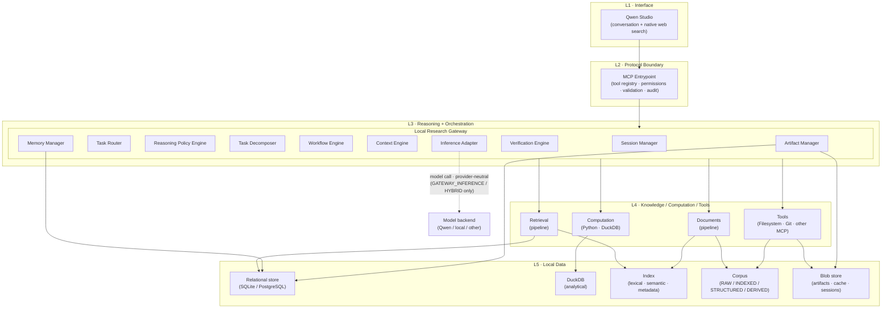

# System Architecture

**Notes**

- Dependencies point strictly downward (L1→L5).
- This is the **capability topology**, not a universal execution path. The
  `Inference Adapter` and its edge to the model backend are **conditional on
  mode**: dormant in `STUDIO_NATIVE`, active in `GATEWAY_INFERENCE`/`HYBRID`.
  See [`operating-modes.md`](operating-modes.md) for the per-mode flows.
- The Inference Adapter is the *only* component that contacts a model backend,
  and it does so through the provider-neutral `InferenceProvider` interface.
- `QW` (model backend) is outside the system and swap-able. In `STUDIO_NATIVE`
  the model backend lives inside Qwen Studio, not behind the adapter.
