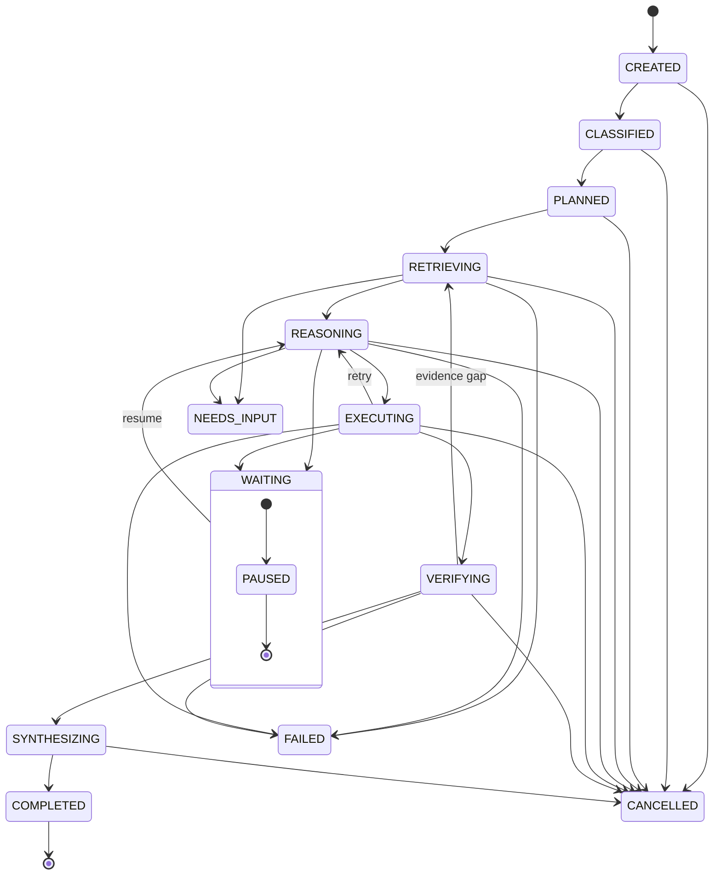

# Task State Machine

**Notes**

- A task is **resumable** at any state boundary.
- Workflow state is **never encoded only in memory** — the architecture assumes
  persistence will eventually exist (see
  [`domain-contracts.md`](../domain-contracts.md#7-task-state-machine)).
- `VERIFYING → RETRIEVING` is the verification-driven loop (evidence gap).
