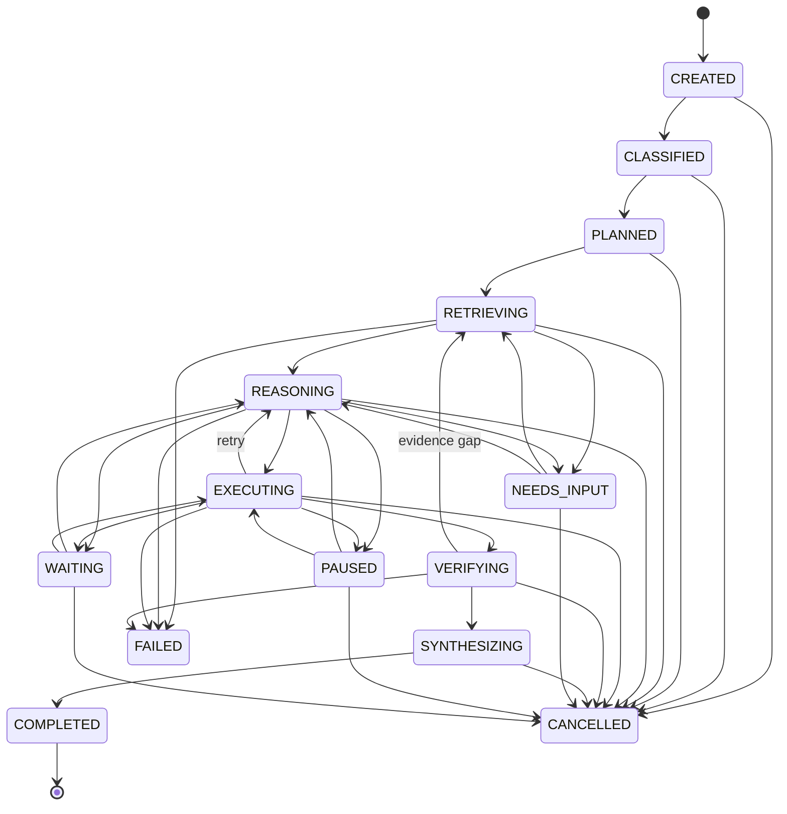

# Task State Machine

**Notes**

- **Execution states** (the linear progression plus `FAILED`/`CANCELLED`):
  `CREATED → CLASSIFIED → PLANNED → RETRIEVING → REASONING → EXECUTING →
  VERIFYING → SYNTHESIZING → COMPLETED`.
- **Control/suspension states**: `PAUSED`, `WAITING`, `NEEDS_INPUT` — valid
  *domain* states, but the runtime does not yet operate a pause/resume engine
  (reserved in Phase 1.1).
- **Terminal states**: `COMPLETED`, `FAILED`, `CANCELLED` — no outgoing
  transitions. `NEEDS_INPUT` (and the other control states) are non-terminal.
- `VERIFYING → RETRIEVING` is the verification-driven loop (evidence gap);
  `EXECUTING → REASONING` is the retry loop.
- A task is **resumable** at any state boundary; workflow state is never
  encoded only in memory.
