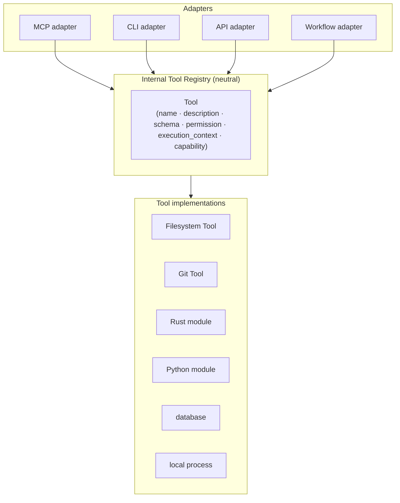
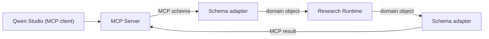

# Internal Tool Registry

MCP is one adapter around the Internal Tool Registry, not the registry itself.

## MCP adapter boundary

- The MCP wire schema is **not** the internal domain model (ADR 0023).
- Only capabilities with a reason to be exposed are published as MCP tools;
  MCP is not the internal plugin architecture (ADR 0020).
